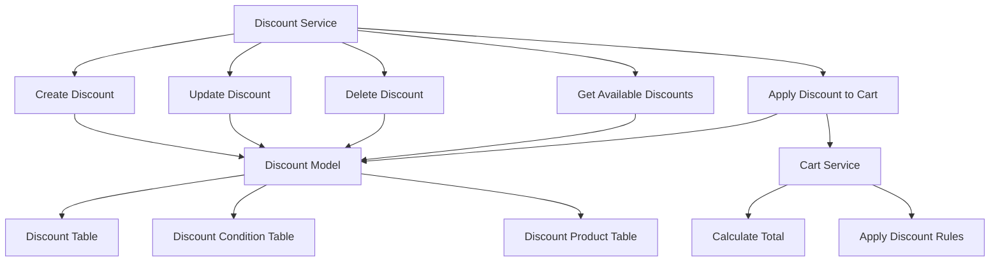

# 購物車折扣規劃

## 系統架構



## 數據庫設計

### Discount Table

| 欄位名稱   | 類型                                                                      | 描述     |
| ---------- | ------------------------------------------------------------------------- | -------- |
| id         | BIGINT                                                                    | 主鍵     |
| name       | VARCHAR(255)                                                              | 折扣名稱 |
| type       | ENUM('PERCENTAGE', 'FIXED', 'THRESHOLD', 'BUY_ONE_GET_ONE', 'MULTI_ITEM') | 折扣類型 |
| value      | DECIMAL(10,2)                                                             | 折扣值   |
| start_date | DATETIME                                                                  | 開始日期 |
| end_date   | DATETIME                                                                  | 結束日期 |
| priority   | INT                                                                       | 優先級   |
| created_at | DATETIME                                                                  | 創建時間 |
| updated_at | DATETIME                                                                  | 更新時間 |

### Discount Condition Table

| 欄位名稱    | 類型                                              | 描述                   |
| ----------- | ------------------------------------------------- | ---------------------- |
| id          | BIGINT                                            | 主鍵                   |
| discount_id | BIGINT                                            | 外鍵，關聯 Discount 表 |
| type        | ENUM('MEMBERSHIP_LEVEL', 'PRODUCT', 'CART_TOTAL') | 條件類型               |
| value       | VARCHAR(255)                                      | 條件值                 |
| created_at  | DATETIME                                          | 創建時間               |
| updated_at  | DATETIME                                          | 更新時間               |

### Discount Product Table

| 欄位名稱    | 類型     | 描述                   |
| ----------- | -------- | ---------------------- |
| id          | BIGINT   | 主鍵                   |
| discount_id | BIGINT   | 外鍵，關聯 Discount 表 |
| product_id  | BIGINT   | 商品 ID                |
| created_at  | DATETIME | 創建時間               |
| updated_at  | DATETIME | 更新時間               |

## API 設計

### 創建新折扣

- Method: POST
- Path: /discounts
- Request Body:

```json
{
  "name": "夏季特惠",
  "type": "PERCENTAGE",
  "value": 20.0,
  "start_date": "2025-06-01T00:00:00Z",
  "end_date": "2025-08-31T23:59:59Z",
  "priority": 1,
  "conditions": [
    {
      "type": "MEMBERSHIP_LEVEL",
      "value": "GOLD"
    }
  ],
  "products": [
    {
      "product_id": 123
    }
  ]
}
```

### 更新折扣信息

- Method: PUT
- Path: /discounts/{id}
- Request Body: 同創建新折扣

### 刪除折扣

- Method: DELETE
- Path: /discounts/{id}

### 獲取可用折扣列表

- Method: GET
- Path: /discounts
- Query Parameters:
  - user_id: 用戶 ID
  - cart_total: 購物車總金額
  - product_ids: 商品 ID 列表

### 應用折扣到購物車

- Method: POST
- Path: /carts/{id}/apply-discount
- Request Body:

```json
{
  "user_id": 456,
  "cart_total": 1000.0,
  "product_ids": [123, 456]
}
```

## 實現步驟

1. 新增折扣相關的 model
2. 新增折扣相關的 service
3. 新增折扣相關的 handler
4. 修改購物車結算邏輯
5. 新增單元測試
